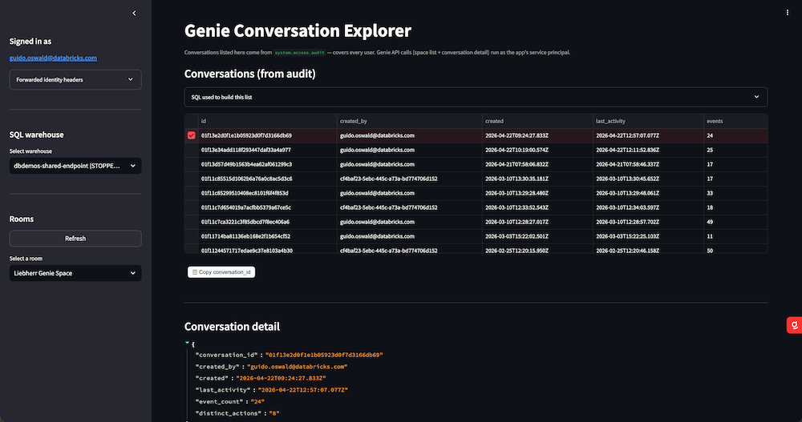

# Genie Conversation Explorer

A Databricks App that gives you an **admin-style, cross-user view** of every
Genie conversation in a workspace: the rooms (Genie spaces), the conversations
inside them, and the full message detail — generated SQL, Genie's reasoning
thoughts, assistant text, suggested follow-ups, and audit / feedback trails
from `system.access.audit`.

Deployable via Databricks Asset Bundles (DAB).



## Features

- **Rooms panel** (sidebar) — lists every Genie space the app's service
  principal can see, via `GET /api/2.0/genie/spaces`.
- **SQL warehouse picker** (sidebar) — three-tier warehouse discovery:
  1. `WorkspaceClient.warehouses.list()` (SDK management API).
  2. Fallback to `system.compute.warehouses` via Statement Execution.
  3. Last-resort: the default warehouse from `DATABRICKS_WAREHOUSE_ID`.
  Any tier's error is surfaced in a collapsible "fallback used" panel.
- **Signed-in user** — pulled from Databricks Apps' forwarded identity
  headers (`x-forwarded-email`, `x-forwarded-preferred-username`), no user-auth
  scopes required.
- **Conversations table** (full width) — driven by `system.access.audit`:
  shows every conversation in the room across every user with `created_by`,
  `created`, `last_activity`, `events`, `distinct_actions`.
  - Rendered in monospace for fast scanning.
  - **Click a row to select** — no dropdown.
  - **📋 Copy conversation_id** button.
  - Expander with the exact SQL that built the list + copy button.
- **Conversation detail** — for each message in the conversation:
  - User prompt (when present).
  - **Generated SQL** with syntax highlighting and a **📋 Copy SQL** button.
  - Genie's reasoning trace (`Description`, `Understanding`, `Data Sourcing`,
    `Steps` — from the `thoughts[]` array).
  - Assistant text response.
  - Suggested follow-up questions.
  - Inline feedback (thumbs up/down) if present on the message.
  - Raw message JSON on toggle.
- **Audit trail** for the selected conversation from `system.access.audit`
  (all `aibiGenie` events tied to that conversation_id).
- **Feedback events** — rows where `action_name` matches
  `%feedback%` / `%rating%` / `%thumb%`.

## How it works

### Why the conversation list comes from `system.access.audit` and not the Genie REST API

`GET /api/2.0/genie/spaces/{space_id}/conversations` is **per-caller-scoped**:
it only returns conversations created by the calling identity. The app's
service principal has never chatted with any Genie space, so that endpoint
would return an empty list — even in rooms with hundreds of user conversations.

Instead, we query `system.access.audit` for `service_name = 'aibiGenie'` and
group by `request_params['conversation_id']`. This surfaces every conversation
across every user — the same picture the Genie Monitoring tab shows a space
manager.

### Why we don't use `GET /conversations/{id}`

That endpoint doesn't exist — Databricks Apps returns a routing-level 404.
The Genie REST API only exposes
`GET /api/2.0/genie/spaces/{space_id}/conversations/{conversation_id}/messages`,
which already includes every message with its attachments (query, thoughts,
text, suggested questions) inline. The app uses that endpoint directly.

### Auth model

Everything runs as the app's **service principal** (OAuth M2M via
`DATABRICKS_CLIENT_ID` / `DATABRICKS_CLIENT_SECRET` injected by the Apps
runtime; the SDK picks them up via `Config()`).

We tried on-behalf-of user auth first, but the downscoped user token blocked
both `warehouses.list()` (management API) and `/api/2.0/sql/statements`
(Statement Execution) with scope errors on this workspace. Using the SP for
everything keeps the app simple and robust.

The signed-in user is shown purely from the HTTP forwarded headers — no
user-auth scopes required.

## Project layout

```
.
├── databricks.yml                     # Bundle root + dev/prod targets
├── resources/
│   ├── genie_explorer_app.yml         # App resource + SQL warehouse binding
│   └── Genie_Conversation_explorer.png
└── src/app/
    ├── app.py                         # Streamlit UI
    ├── backend.py                     # Genie REST + Statement Execution client
    ├── app.yaml                       # App runtime (command + env)
    └── requirements.txt
```

## Prerequisites

- Databricks CLI ≥ 0.239 (DAB `apps` resource support).
- A SQL warehouse. The bundle looks it up by the name `Shared SQL Warehouse`;
  change `variables.warehouse_id.lookup.warehouse` in `databricks.yml` if yours
  is named differently. This becomes the dropdown's default.
- The **app's service principal** needs:
  - **CAN VIEW** on every Genie space you want to surface (or workspace admin).
  - **CAN USE** on the default SQL warehouse (granted automatically via the
    DAB app resource). The dropdown lists all warehouses the SP can *see*;
    queries against a warehouse the SP lacks **CAN USE** on will fail at
    runtime — grant broader permissions in the workspace UI if you want to
    switch warehouses.
  - Access to the `system` catalog's `access` schema — enable the `access`
    system schema in Unity Catalog and grant `SELECT` on
    `system.access.audit` to the SP (also `system.compute.warehouses` if you
    want the SQL-based warehouse fallback to work).

## Deploy

```bash
# Validate
databricks bundle validate -t dev

# Deploy bundle (uploads source + creates / updates app resource)
databricks bundle deploy -t dev

# Start the app
databricks bundle run genie_explorer -t dev
```

Tail logs:

```bash
databricks apps logs genie-explorer-dev
```

To deploy to `prod`:

```bash
databricks bundle deploy -t prod
databricks bundle run genie_explorer -t prod
```

## Configuration

| Where | Key | Purpose |
|---|---|---|
| `databricks.yml` | `variables.warehouse_id.lookup.warehouse` | Warehouse-by-name used as the bundle-provisioned default. |
| `databricks.yml` | `targets.{dev,prod}.workspace.profile` | Databricks CLI profile for each target. Default `DEFAULT`. |
| `resources/genie_explorer_app.yml` | `user_api_scopes` | Currently empty — app uses SP auth only. |
| `src/app/app.yaml` | `env[DATABRICKS_WAREHOUSE_ID].valueFrom: sql-warehouse` | Injects the warehouse ID from the DAB app-resource binding. |

## Known caveats

- **`system.access.audit` must be enabled** in the workspace for the
  conversation list (and the audit/feedback panels) to return anything.
  Databricks audit logs have a short delay — brand-new conversations may take
  a few minutes to appear.
- **`system.compute.warehouses`** is used for the warehouse-list SQL fallback.
  If it's not enabled or the SP lacks SELECT, the dropdown collapses to just
  the default warehouse (still functional).
- Conversation **title** is not retrievable via SP auth — the detail panel
  uses audit-derived fields (`created_by`, `created`, `last_activity`) for
  header metadata instead.
- User **feedback** on a message surfaces both via the inline `feedback`
  field on the Genie `/messages` response (when present) and via
  `system.access.audit` rows where `action_name` matches feedback/rating/thumb.

## References

- [Genie Conversation API](https://docs.databricks.com/aws/en/genie/conversation-api)
- [Genie REST API reference](https://docs.databricks.com/api/workspace/genie)
- [Configure authorization in a Databricks app](https://docs.databricks.com/aws/en/dev-tools/databricks-apps/auth)
- [Databricks Asset Bundles — Apps resources](https://docs.databricks.com/aws/en/dev-tools/bundles/resources)
- [system.access.audit](https://docs.databricks.com/aws/en/admin/system-tables/audit-logs)
